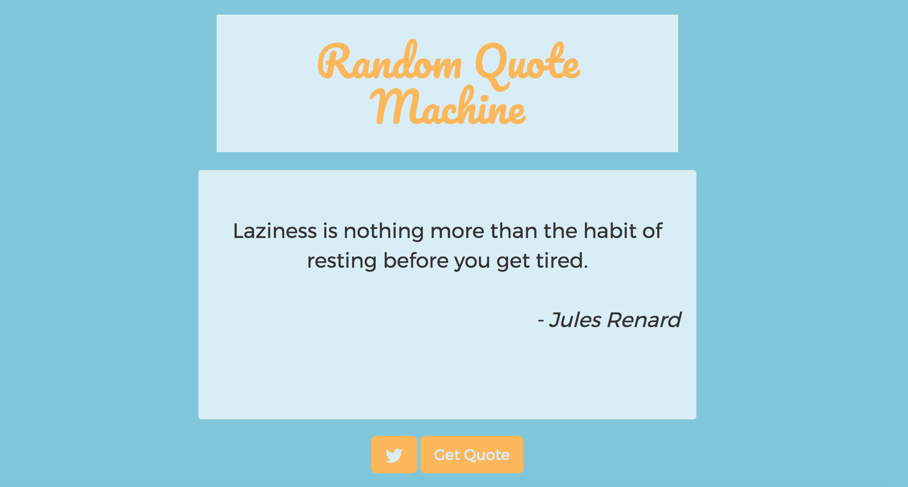

# Random Quote Machine

### FreeCodeCamp challenge
#### by Paweł Kłeczek

Check it out on CodePen:
http://codepen.io/pawelkleczek/full/bwjRmz/

## What is it?

Random Quote Machine was done as part of a FreeCodeCamp challenge. It uses some css and javascript to generate random quotes. Quotes are placed in a external JSON file. The second functionality of this app is, that you can post the quote to Twitter. There are two buttons - one for the quotes, and second to put the quote on Twitter. 

